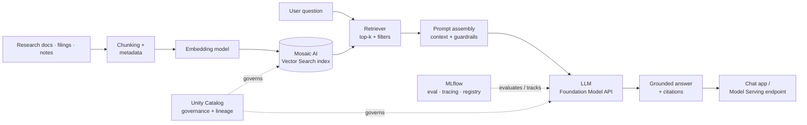

# Financial Research RAG (Databricks GenAI)

> Governed Retrieval-Augmented Generation over financial research, built on the Databricks AI platform · **2025** · GenAI

**Role at the time:** Hands-on Staff Data Engineer · Data & AI Platform Engineering · *(2025 — present role)*
**Type:** Portfolio case study — architecture & approach are representative; production code is proprietary.

---

## Context

Analysts spend hours hunting across research notes, filings and internal documents for answers that already exist somewhere in the corpus. A general-purpose chatbot can't help here: answers must be **grounded in the firm's own documents**, **cited**, and **governed** — no hallucinated numbers, no data leaving the security boundary.

This project (**circa 2025**) delivers a **Retrieval-Augmented Generation** assistant on the **Databricks Data Intelligence Platform**: documents are chunked and embedded into **Mosaic AI Vector Search**, a retriever grounds an **LLM** in the relevant passages, and the whole system is **evaluated with MLflow** and **governed by Unity Catalog**. It is the **GenAI / AI-platform** stage of my journey — applying everything from the lakehouse era to a first generative-AI proof-of-concept — the direction I'm now extending into.

## Architecture

## Tech stack

- **Platform:** Databricks Data Intelligence Platform
- **Retrieval:** Mosaic AI Vector Search (embeddings index, hybrid/semantic retrieval)
- **Generation:** LLMs via Databricks Foundation Model APIs / Model Serving
- **LLMOps:** MLflow (evaluation, tracing, prompt/version registry), Mosaic AI Agent Evaluation
- **Governance:** Unity Catalog (documents, indexes, models, lineage, access control)
- **Data foundation:** Delta Lake (source documents + chunk tables), PySpark for batch embedding
- **Languages:** Python, SQL

## Data model & architecture

- **Document → chunk → embedding lineage** — source documents in Delta, a **chunk table** (text + section/source metadata), and a **vector index** synced from it, all registered in Unity Catalog so retrieval is auditable.
- **Metadata-filtered retrieval** — chunks carry source, date, entity and access tags, enabling permission-aware and recency-aware retrieval rather than blind similarity.
- **Evaluation dataset** — curated question/ground-truth pairs drive MLflow evaluation (faithfulness, relevance, correctness) as a regression gate on changes.

## Key design decisions

- **Ground and cite, always** — answers are constrained to retrieved context and return citations, so analysts can verify rather than trust blindly.
- **Chunking is a design parameter, not a default** — chunk size/overlap and metadata tuned to the document structure, because retrieval quality caps answer quality.
- **Evaluate like software** — MLflow eval on a fixed question set turns "the bot feels better" into measured faithfulness/relevance deltas before anything ships.
- **Govern the whole RAG surface** — Unity Catalog over documents, indexes and models keeps sensitive content access-controlled and the pipeline lineage-traceable.
- **Guardrails + permission-aware retrieval** — filters and safety checks keep the assistant inside policy and inside each user's data boundary.

## Outcome & impact

- **Grounded, cited answers** over the firm's own corpus — useful where a generic LLM is not.
- **Faster research** — analysts retrieve synthesized, sourced answers in seconds instead of manual searching.
- **Measured quality** — MLflow evaluation makes accuracy and regressions visible and gated, not anecdotal.
- **Enterprise-ready by construction** — governed, access-controlled and lineage-tracked end to end on a single platform.

## Where this sits in my journey

Part of my **Data & AI Platform Engineering** portfolio — the **2025 GenAI / AI-platform** stage (my current role) — my first GenAI proof-of-concept and the direction I'm now extending into.

⏮ prev: [grant-data-integration-databricks-pipeline](https://github.com/kamalakarpeta/grant-data-integration-databricks-pipeline) · ⏭ next: [enterprise-lakehouse-microsoft-fabric](https://github.com/kamalakarpeta/enterprise-lakehouse-microsoft-fabric)
Full journey: https://kamalakarpeta.github.io

## Contact

LinkedIn: https://www.linkedin.com/in/kamalakarpeta/
